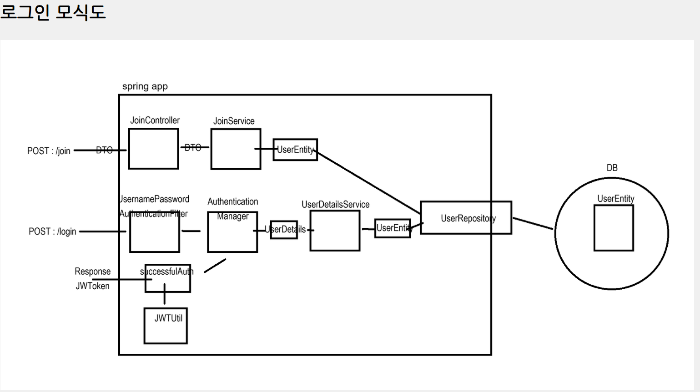

참고 : https://www.devyummi.com/page?id=668cfe58d3b43a6241eb6b6c

0.12.3 버전 : build.gradle
dependencies {

    implementation 'io.jsonwebtoken:jjwt-api:0.12.3'
    implementation 'io.jsonwebtoken:jjwt-impl:0.12.3'
    implementation 'io.jsonwebtoken:jjwt-jackson:0.12.3'
}

LoginFilter // 로그인 진행
JwtUtil // jwt 발행

---

참고 : https://www.devyummi.com/page?id=66937e102991346fee18ea37
